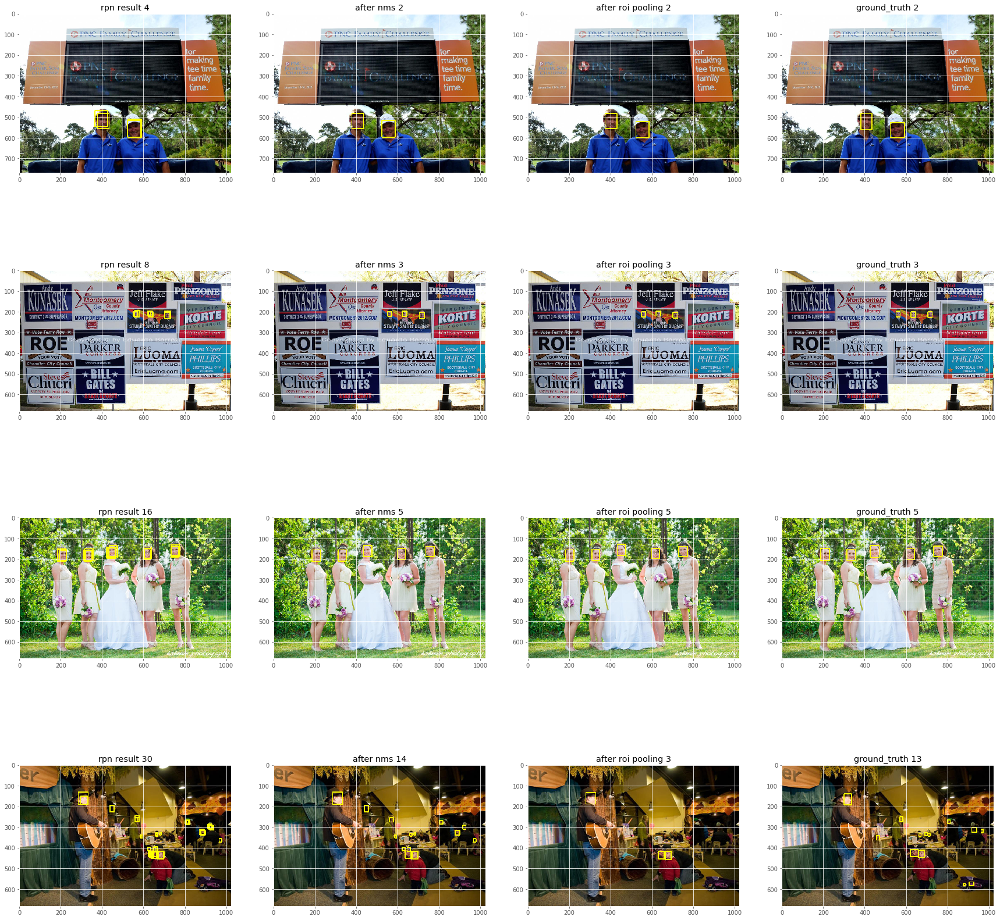
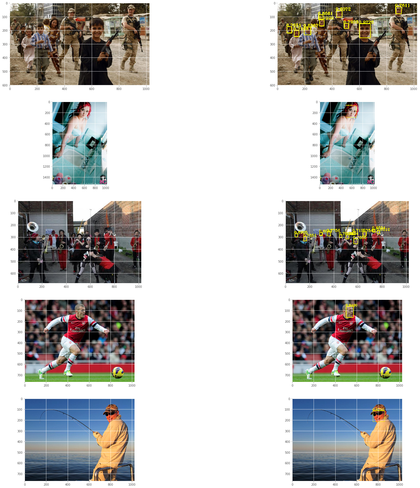
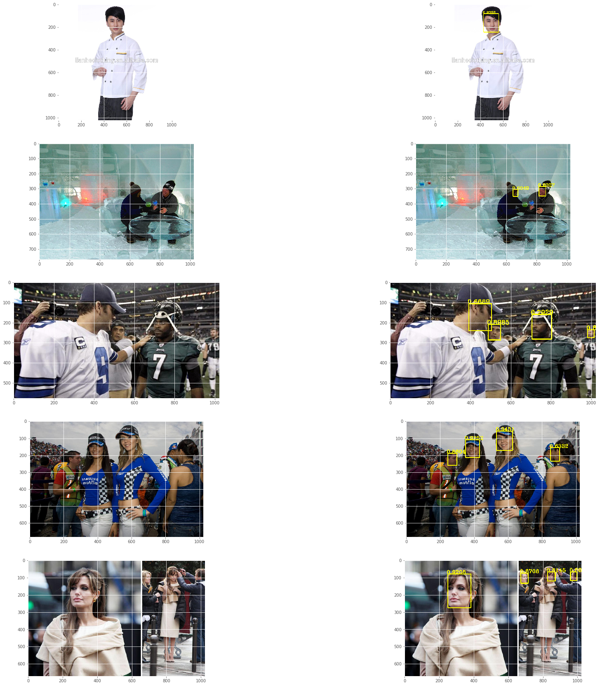

# Object detection using tensorflow
This project is still under develop.

# purpose
The purpose of this project is to (re)implement a series of object detection networks ground-up, all the nets are writted in a readable manner in (almost) a single ipython-notebook, that would be only a few hundred lines of code, and we also provide some sample to use our model.
So if you are new to object detection, you can play with the model we write and change some structure, maybe change the dataset, or hyper parameters and see what will happen.

# dataset
We use WIDER FACE as our object-detection dataset and our task would naturally be -- face detection.

# about model
We plan to implement some object-detection models in tensorflow && python.

We have implemented a end-to-end faster rcnn model in tensorflow, reaching a 10 fps detection speed in 1080ti gpu , detecting human face in pictures with size about 1024 * 1024.

Some of our model's result:

# training
## faster rcnn
We use a end-to-end method to jointly train faster-rcnn's rpn net and roi net, use Keras's pretrained VGG16 model's weight as pretrained model weight.

Training speed is about 3 pic/s , network converges after 10 epochs of training.

# result

# future work

* YOLO implemention
* SSD implemention
